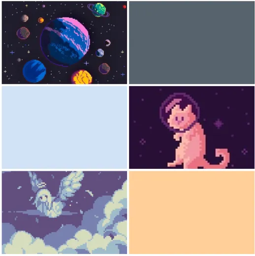
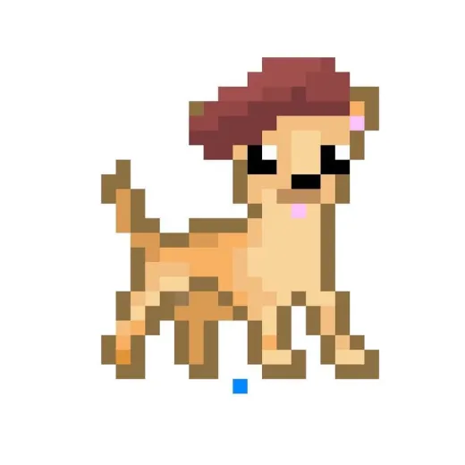
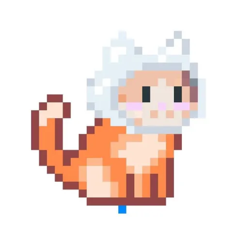
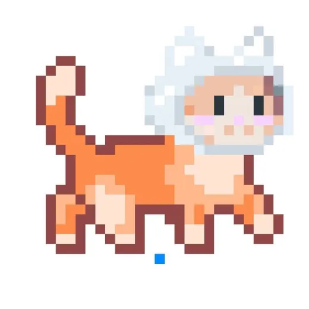

# Callipo the Castronaut 

 By Callipo Studios
 
 Members: 

          
          Alisha Din 2407354 
          Ana Kushchyk 2408544
          Cameron Sayers 2401066
          Mia Barclay 2405897

## Overview
This is a tile map, level based game in which the player needs to navigate their way through the levels, each getting progressively harder until the player suceeds in beating the levels. There will be enemies in which the player can shoot at and kill that also shoot at you. There are ice creams which serve as a point system which you will need to collect a certain amount to pass the level. 

## Narrative 

 The narrative of our game is about Callipo (a ginger space cat) who is travelling from the magically cold Ice-Cream planet to the Cat planet, but he gets aggressively attacked by a hoard of space-pirate dogs. Callipo also owns an Ice Cream van but during the attack, the dogs wrecked and stole it, but while they spaced (drove) off, all the deliciously sweet ice cream dramatically tumbled out of the rear end of the van. Now, our protagonist Callipo must venture onto a rescue mission to restore and collect the sweet cargo that the oh so evil dogs lost. At the end, Callipo must safely return to the Cat planet with his fully stocked Van of ice cream. 

## Game Mechanics 

The Player (callipo) must avoid attacks from the pirate dogs while collecting the fallen ice-creams. Each collected ice cream means that the player gains a point.  

At the beginning of each new level, the dogs upgrade (to different breeds) and become stronger, while the difficulty for Callipo increases.  

The final boss that Callipo must face, is yappy little Chichi the space chihuahua. He must face Chichi inside the Ice cream vans and finally defeat the evil chihuahua.  

Another aim is to have Calipo shoot little bullets that fly towards the dogs. After multiple shots they die 
and disappear.
To move Calipo, the player must use the keys - 'WASD' and attack the dogs by using the space bar.

## References 

We used the code from lesson as a base in regards to tile mapping and movement.

https://editor.p5js.org/ethanfrier/sketches/Sz8fGi37K
This is what we referenced in order to create a shooting mechanic. We are looking to work and improve this as we have not yet got it to work.

https://www.youtube.com/watch?v=JHBuRkJObIg&list=PLBDInqUM5B25FzygoJ9Ifg1TZXmIHz4zh&index=7
Referenced this video to create game stages and to help create a simple start screen. Further I will take the code and adjust it to make various different levels and an end screen.

All of our assets currently are images found online. They are simply placeholder images while we create our own assets.

## Themes 

The colours and themes for this game will be space-centred, with cute pastel colours for certain characters,
backgrounds and items. Inspiration derives from super-mario and 8bit pixel art. One aim we have is to have
different backgrounds for the three levels. Some examples include the first being a simple, starry sky in 
space. The second could possibly have little planets displayed in the background if that's not too ambitious
with the workload and deadline considered. Then the final idea for the background is Calipos van. As 
mentioned in game mechanics, the final level ("fight") plans to take place inside the Ice-Cream van.

## Future Implementations
Some aspects we will work to add in the future include multiple levels, sound effects/background music, fighting mechanics, moving enemies etc. 
 
## Aesthetics

We are going for a very cute hyper style theme, which is reflected in the pastel colours we are using. We are also creating all of our assets in a retro pixel art style. A lot of it is also inspired by older retro style video games. 

### Moodboard
 

### Assets
 
Chichi the space dog pirates leader

 
Callipo sitting

 
Callipo walking right

## Roles for the team 

Tile mapping, Main menu, pause menu & Scene changes = Alisha 

I used the tile mapping code from lesson as a base to create the background of the game. I used placeholder assets for now until our art assets have been created. I want to improve on the tile mapping by firstly making it bigger and also adding more strategic collisions. I also want to create a kind of collision where if the player hits a certain square on the tile map, they get sucked in and pop out of another section, a kind of tunnel system. I also created the stage scene mechanic which controls what function is displayed when. I set it up so it always first opens on the title starting screen, and after the player clicks the screen - which is the condition- it will increment the stage value by 1 causing the scene to change to the game play and allowing the user to play the game. I also want to improve on this by adding various different levels and also a condition that if the player dies by getting hit a certain nummber of times, the level resets. As well as if they manage to reach the end, it moves them onto the next level until they reach the last level and win. I also want to create a pause menu to so they can pause the screen whenever they want to. I will research and figure out how to do this layer on.

Player movement, animation/art assets & player fighting, sound = Anya

CODE
I used the player and player movement code from lesson. When the player moves the sprite will change depending on the players direction/the key that they press. I also added in a caps version of wasd as several times while testing we kept on hitting caps lock causing the player not to move- i did this for better player experience. For the shooting mechanic i removed the dots class as after testing i realised that it wasnt necessary so i removed it. For the bullet class i tried to make it so that if you shoot an enemy its destroyed/dies but wasnt able to. Due to the enemy code not being complete for majority of the the time we had it was difficult to experiment and left me with little time to do so. I did some general debbuging of the enemy class alonside Alisha to fix an issue with the enemy display as it would either cause the enemy to take up the whole canvas or break the whole project. I updated the placeholder sprites with the newer ones and added some comments for my sections of the code.
I tried to add sound however after seeing that the loadSound function was undefined i realised that i would need to use a sound library for it- i was unsure of how to get it to work. i tried adding its path to the index but was still getting errors saying that i needed a webpack but even after adding it it still didnt work. I organised both the SFX and libraries into their respective folders if i had more time i would try to properly implement them. 

ART
I drew the background sprites for the tilemap, icecream, start and win screen
-For the background sprites i decided togo for a purple alien feel to go along with the space asnd astronaut theme with some pops of yellow for things like the rocks which the player cannot pass through as it will contrast the purple and indicate that that tile is different from the rest.
-For the icecream i kept the design relatively simple with the green minty icecream ball serving to differentiate it from the yellow rocks and to make it stand out. I ran into an issue when loading the image as despite saving it as a transparent png when loaded onto the code it would be given a black background- to go around this i added one of the tilemap backgrounds behind the icecream- it doesnt work as well as it would if it was an actual transparent png.
-For the start screen i maintained the purple space theme with a pixel art starry sky with fluffy clouds that reflect the silly atmosphere of the story
-For the win screen i drew the protaganist, callipo eating the icecream that he collected in space- making sure that the icecreams would be the same as the ones featured in game for some small added continuity

FUTURE IMPLEMENTATIONS
If i had more time i would make changes such as allowing for continuos player movement instead of having to press the same button over and over again. I would properly add the shooting mechanic. Adding a cooldown to how many times you can shoot. Finally i would add sound effects to things like walking, picking up the icecream, shooting and background music

Point system, picking up objects, life system & read.me file/written work = Mia 

I started off with writing the read.me file with a descriptive narrative of the game plan. Also, I was initially going to just take care of all of the narrative/written work until we realised that everyone had to contribute to code, which was quite the challenge for me (this has since been changed, and not everyone has to contribute code anymore), and it was planned that I'll be doing written work, as well as the point system, picking up objects and now, the life system (this change will be explained later). I then developed the game mechanics section and described how they worked. I also described the themes and inspiration for the game, as well as creating the moodboard which shows our inspiration of pastel colours and 8bit art for the game. With the text code, I successfully included the beginning of the point and life systems, which are displayed at the top of the game screen. To ensure it was out of the way of the game and fixed at the top, I had to adjust the co-ordinates of the texts position multiple times until it appeared in the position I wanted it to be. I started to work on my parts of the code; successfully got the point system in, however, size adjustment of the text is needed (to make it bigger and bolder with strokeweight - This task is a hopeful aim, but not a complete priority). I now have the code ready for the IceCream point systems, but as of now, it is still commented and needs correct placement on the code. Update for 13/03, I have now managed to successfully hit a ice cream and once the player has done that and moved off. At the end of the day, The aim is to have at least 3-4 ice cream collisions and new points gained for the player. This aim has been met! To include more Ice-creams/Points, I had to adjust the position of the texture of the ice-creams on the games X and Y co ordinates of the tile maps, in order to correctly place the ice creams. Initially, the role of player life system was Anya's job but then we swapped it, so I am in charge of doing that now. I have yet to implement the life system for the player, the player will likely have 3 lives and one hit from the enemy would reseult in the loss of 1 heart/life. I am also now responsible for organising the scripts (for example, creating an enemy class.js) in VS code. This was successfully done. 

Killing enemies, Character art, enemy movement & enemy attacking = Cam 

